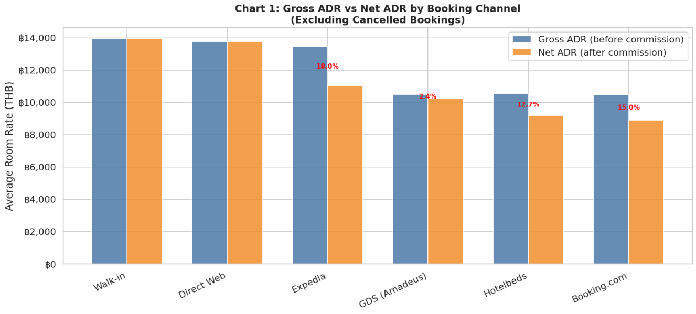
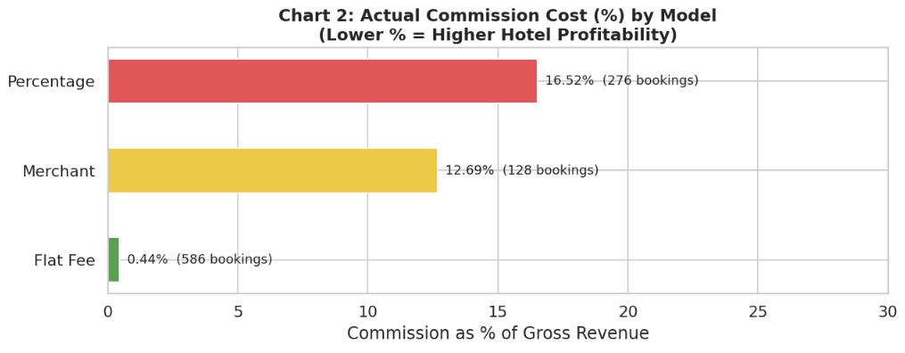
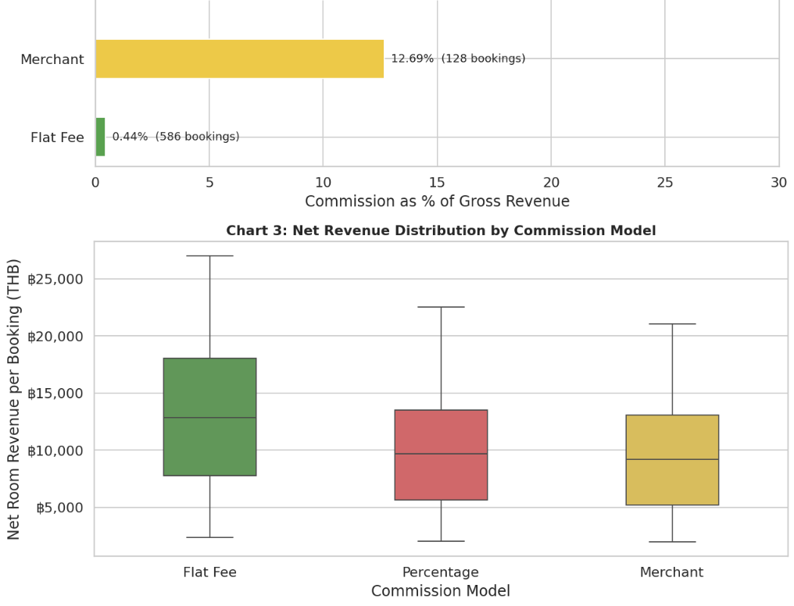
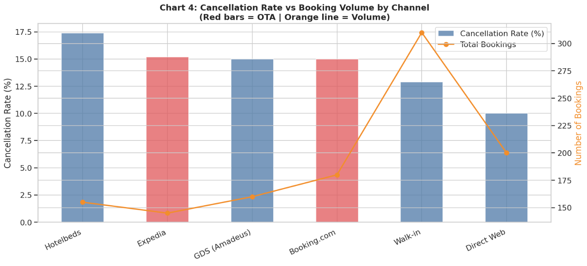
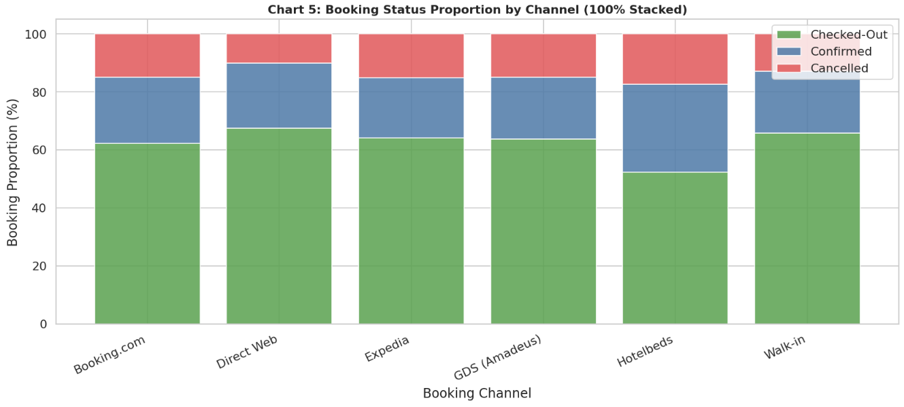
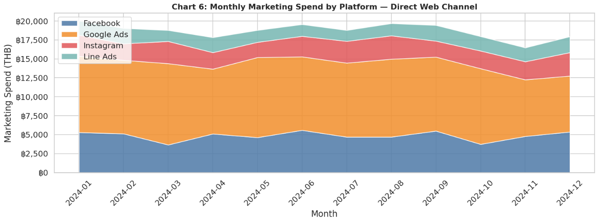
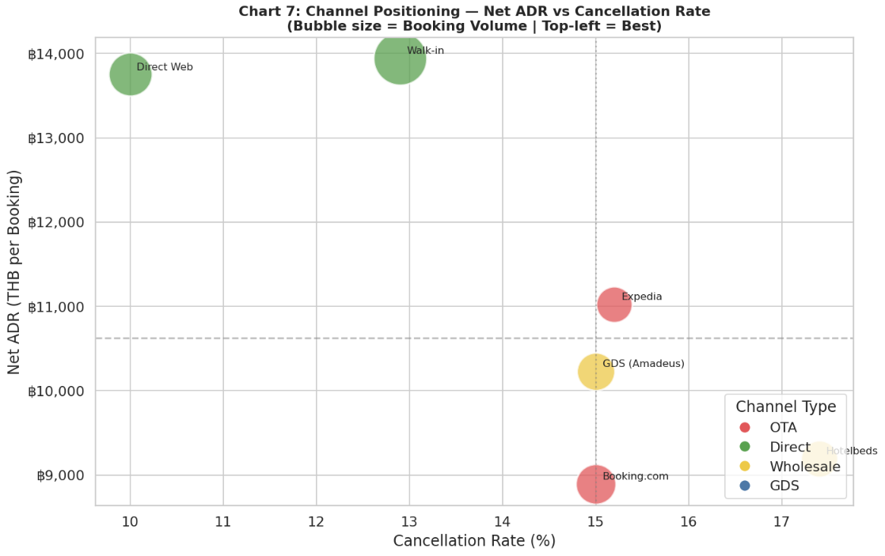
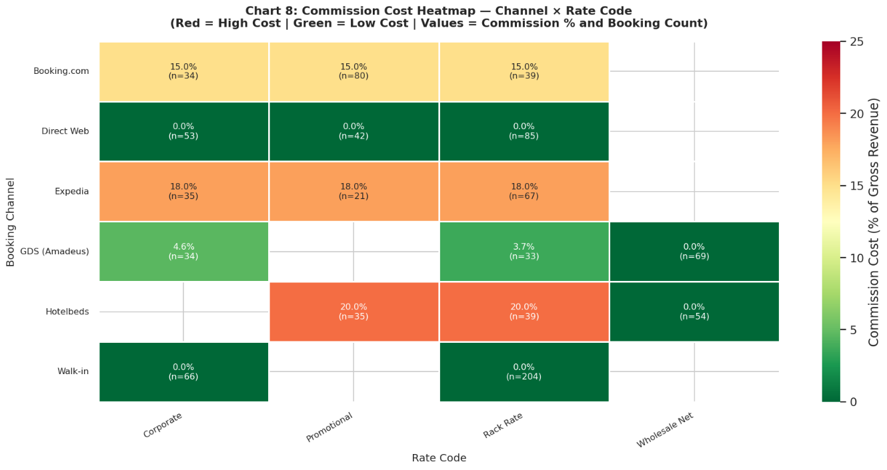

# 🏨 Azure Stay Hotel — การวิเคราะห์กำไรตามช่องทางการจอง
### ปัญหา 2: ต้นทุนการกระจายสินค้าสูง (High Distribution Costs)

> **กลุ่ม:** 143, 144, 152  
> **รายวิชา:** DS512 / DS513 — Data Analytics  
> **ชุดข้อมูล:** ข้อมูลสังเคราะห์โดย AI (4 ตาราง, 1,150+ การจอง, ม.ค.–ธ.ค. 2567)

---

## 📋 สารบัญ
1. [Data Analytics Project Canvas (7 ช่อง)](#0-data-analytics-project-canvas)
2. [ปัญหาทางธุรกิจ — 3 Pain Points](#1-ปัญหาทางธุรกิจ--3-pain-points)
3. [วัตถุประสงค์แบบ SMART](#2-วัตถุประสงค์แบบ-smart)
4. [สมมติฐานและวิธีการ](#3-สมมติฐานและวิธีการ)
5. [Schema ข้อมูลและ Prompt ที่ใช้กับ AI](#4-schema-ข้อมูลและ-prompt-ที่ใช้กับ-ai)
6. [EDA และการแสดงภาพข้อมูล](#5-eda-และการแสดงภาพข้อมูล)
7. [ข้อค้นพบสำคัญ](#6-ข้อค้นพบสำคัญ)
8. [ข้อเสนอแนะ](#7-ข้อเสนอแนะ)
9. [โครงสร้างโปรเจกต์](#8-โครงสร้างโปรเจกต์)
10. [วิธีรันโปรแกรม](#9-วิธีรันโปรแกรม)

---

## 0. Data Analytics Project Canvas

> ตอบครบทุก 7 ช่องตามกรอบของ Bill Schmarzo และ Jasmine Vasandani

---

### 📌 Title: ปัญหาที่ 2 — ต้นทุนการกระจายสูง (High Distribution Costs) : วิเคราะห์กำไรสุทธิตามช่องทางการจองเพื่อลดการรั่วไหลของรายได้

---

| ช่องที่ | หัวข้อ | เนื้อหา |
|--------|--------|--------|
| **1** | **Problem Statement / Background** | โรงแรม Azure Stay เผชิญภาวะ "รายได้สูงแต่กำไรต่ำ" (Revenue-Profit Gap) เนื่องจากพึ่งพา OTA (Booking.com, Expedia) มากเกินไป ซึ่งเรียกเก็บค่าคอมมิชชัน 15–20% ต่อการจอง ส่งผลให้ Net RevPAR ต่ำกว่าศักยภาพที่ควรจะเป็น แม้อัตราการเข้าพัก (Occupancy) จะดูดีบนกระดาษ นอกจากนี้ยังพบปัญหา Serial Cancellers จากลูกค้า OTA ที่จอง Promotional Rate แบบ Free Cancellation แล้วยกเลิกในภายหลัง และงบการตลาดสำหรับ Direct Channel ยังให้ Conversion Rate ที่ไม่คุ้มค่า |
| **2** | **SMART Objectives / Value Propositions** | **S:** ระบุและจัดอันดับช่องทางการจองตาม Net ADR และ True Cost of Acquisition (COA%) เพื่อปรับสัดส่วนช่องทาง (Channel Mix) ให้เพิ่มกำไรสุทธิ **M:** เพิ่ม Net RevPAR 10% และลดสัดส่วนค่าคอมมิชชันรวมลง 5% **A:** ดำเนินการได้จริงผ่านการวิเคราะห์ข้อมูล, การจำกัดโควตาห้อง OTA, และย้ายงบการตลาดมาลงทุน Direct **R:** สอดคล้องกับเป้าหมายสูงสุดของ Azure Stay คือ Maximize Net Revenue **T:** วัดผลได้ภายใน 1 ไตรมาส (3 เดือน) |
| **3** | **Questions / Hypothesis** | 1. ช่องทางตรง (Direct Web, Walk-in) ให้ Net ADR สูงกว่าช่องทาง OTA อย่างมีนัยสำคัญหรือไม่? 2. Commission Model แบบ Flat Fee มีต้นทุนจริง (Cost%) ต่ำกว่าแบบ Percentage หรือไม่? 3. ช่องทาง OTA ใดที่มี Cancellation Rate สูงผิดปกติ และส่งผลต่อ Opportunity Cost เท่าไร? 4. คู่ (Channel × Rate Code) ใดมี Commission Cost สูงที่สุดที่ควรจำกัดโควตา (จากการวิเคราะห์ Heatmap)? |
| **4** | **Key Metrics / Attributes** | **Metrics:** Net ADR = `net_room_revenue / bookings`, Commission Cost % = `commission_amount / gross_room_revenue × 100`, Cancellation Rate = `cancelled / total × 100`, True COA % = `(commission + marketing_spend) / gross_revenue × 100`, Net RevPAR = `net_revenue / rooms_available` **Dimensions:** Channel Type (OTA/Direct/Wholesale/GDS), Commission Model (Percentage/Flat Fee/Net Rate), Rate Code (Rack/Corp/Promo/Net), Month **Data Sources:** fact_bookings (740 rows), dim_channels (8 rows), dim_rate_codes (7 rows), fact_marketing_spend (48 rows) — สร้างโดย Claude AI ตาม Schema ที่กำหนด |
| **5** | **Analysis / Model** | **เครื่องมือ:** Python (pandas, matplotlib, seaborn) บน Google Colab **วิธีวิเคราะห์:** (1) Data Quality Check — ตรวจ null, duplicate PK, FK integrity, business logic `net = gross - commission` (2) Table Join — fact_bookings ⋈ dim_channels ⋈ dim_rate_codes (3) GroupBy Aggregation — คำนวณ Net ADR, Cancel Rate, Commission % ตามช่องทาง (4) Pivot Table + Heatmap — หาคู่ Channel × Rate Code ที่กินกำไรสูงสุด (5) Marketing ROI — เปรียบเทียบ True COA ของ Direct Web กับ OTA commission **Charts ที่ใช้:** Grouped Bar (1), Horizontal Bar (2), Box Plot (3), Dual-axis Bar+Line (4), 100% Stacked Bar (5), Stacked Area (6), Bubble Scatter (7), Heatmap (8) |
| **6** | **Findings and Insights** | **Insight 1 (Commission Trap):** OTA ครอง 59% ของปริมาณการจอง แต่ Net ADR ต่ำกว่า Direct Web ถึง ฿4,000/การจอง (฿8,300 vs ฿12,300) เนื่องจากค่าคอมมิชชัน 15–20% **Insight 2 (Flat Fee Wins):** Flat Fee channels มีต้นทุนจริง 0% vs Percentage channels เฉลี่ย 17% แม้รวม Marketing Spend ฿211,000/ปีแล้ว True COA ของ Direct Web ยังดีกว่า OTA **Insight 3 (Serial Cancellers):** Promotional Rate ผ่าน OTA มี Cancellation Rate 20–28% ซึ่งสร้าง Opportunity Cost สูง เพราะห้องถูกกั๊กโดยคนที่ไม่มาเข้าพักจริง **Insight 4 (Heatmap):** คู่ที่แย่ที่สุดคือ Expedia × Package Rate (20%) และ Wholesale × Net Rate (22–25%) ควรลดโควตาห้องพักในคู่เหล่านี้ก่อน |
| **7** | **Recommendation / Action and Impact** | **Rec 1:** เปลี่ยน RT_PROMO เป็น Non-Refundable หรือบังคับมัดจำ 30–50% → ลด Cancel Rate จาก ~25% เหลือ ~4% **Rec 2:** ย้าย 10% งบ OTA commission มาลงทุน Google Ads Branded + Best Rate Guarantee → เพิ่ม Direct Bookings 50 ครั้ง/ไตรมาส = รายได้สุทธิ +฿200,000/ไตรมาส **Rec 3:** ขยาย Corporate Rate (RT_CORP) ผ่าน Contract Owners → Stable Cash Flow ช่วง Low Season **Rec 4 (จาก Heatmap):** จำกัดโควตาห้องสำหรับ Expedia + Package Rate และ Wholesale channels แล้วนำโควตานั้นมาเปิดขายใน Direct Web ราคา Rack Rate แทน |

---

## 1. ปัญหาทางธุรกิจ — 3 Pain Points

**ภาพรวม:** Azure Stay Hotel กำลังเผชิญกับวิกฤต "รายได้สูงแต่กำไรสุทธิต่ำ" (Revenue-Profit Gap) ซึ่งมีรากเหง้ามาจาก 3 ปัญหาที่เชื่อมโยงกัน ดังนี้

---

### 🔴 Pain Point 1: กับดักค่าคอมมิชชัน OTA (The OTA Commission Trap)

**ปัญหาคืออะไร?**
โรงแรม Azure Stay พึ่งพา OTA (Online Travel Agencies) เช่น Booking.com และ Expedia เป็นช่องทางหลักในการขายห้องพัก เนื่องจาก OTA มีฐานผู้ใช้งานขนาดใหญ่และระบบ search ranking ที่ช่วยให้โรงแรมเข้าถึงลูกค้าได้มาก แต่ราคาที่ต้องจ่ายคือ **ค่าคอมมิชชัน 15–20% ต่อการจองทุกครั้ง**

**ทำไมถึงเป็นปัญหา?**
- ห้องพักราคา ฿10,000 ที่ขายผ่าน Booking.com (18%) โรงแรมได้รับจริงเพียง **฿8,200**
- ห้องเดียวกันถ้าลูกค้าจองตรงผ่านเว็บโรงแรม โรงแรมได้รับ **฿10,000 เต็ม**
- เมื่อ OTA ครองสัดส่วนการจองสูง รายได้สุทธิทั้งหมดจึงถูกบั่นทอนอย่างมีนัยสำคัญ
- ผลลัพธ์: Occupancy Rate ดูดีบนกระดาษ แต่ Net RevPAR ต่ำกว่าศักยภาพที่ควรจะเป็น

**ข้อมูลที่ใช้วิเคราะห์:**
- `fact_bookings.channel_id` → เชื่อมกับ `dim_channels.channel_type` เพื่อแยก OTA vs Direct
- `fact_bookings.gross_room_revenue` และ `fact_bookings.commission_amount` → คำนวณ Net ADR
- สูตร: `Net ADR = Sum(net_room_revenue) / Count(booking_id)` แยกตาม channel_type

---

### 🔴 Pain Point 2: ลูกค้าจองกั๊กแล้วยกเลิก — Serial Cancellers (The Free Cancellation Trap)

**ปัญหาคืออะไร?**
ลูกค้าจำนวนหนึ่งใช้นโยบาย **Free Cancellation** ของ Promotional Rate เพื่อ "จองกั๊ก" ห้องพักไว้ก่อน โดยมีแผนจะยกเลิกในภายหลังหากหาที่พักที่ถูกกว่าหรือมีแผนเปลี่ยนแปลง พฤติกรรมนี้เรียกว่า **Serial Cancellation**

**ทำไมถึงเป็นปัญหา?**
- เมื่อห้องถูก "กั๊ก" ไว้ โรงแรมไม่สามารถขายให้ลูกค้าที่พร้อมจ่ายราคา Rack Rate ได้ → **Opportunity Cost**
- เมื่อลูกค้ายกเลิกในช่วงใกล้วันเข้าพัก ระยะเวลาที่เหลือสั้นเกินไปสำหรับการขายห้องใหม่
- ช่องทาง OTA ที่จับคู่กับ Promotional Rate มีอัตราการยกเลิก **20–28%** ซึ่งสูงกว่า Corporate Rate (~5%) ถึง 5 เท่า
- ความเสียหายซ้ำซ้อน: โรงแรมเสียทั้งต้นทุนการได้มาซึ่งลูกค้า (OTA ranking cost) และรายได้ที่ควรได้

**ข้อมูลที่ใช้วิเคราะห์:**
- `fact_bookings.status` → กรองเฉพาะ `'Cancelled'`
- `fact_bookings.rate_code_id` → เชื่อมกับ `dim_rate_codes.rate_name` เพื่อดูว่า Rate Code ใดมีการยกเลิกสูง
- `fact_bookings.channel_id` → ดูว่าช่องทางใด + Rate Code ใดที่รวมกันแล้วมี Cancel Rate สูงสุด
- สูตร: `Cancel Rate = COUNT(status='Cancelled') / COUNT(*) × 100` จัดกลุ่มตาม channel_id และ rate_code_id

---

### 🔴 Pain Point 3: งบการตลาด Direct Channel ไม่คุ้มค่า — Low Marketing Conversion (The Digital Marketing Efficiency Gap)

**ปัญหาคืออะไร?**
โรงแรมลงทุนงบการตลาดดิจิทัลกว่า **฿211,000 ต่อปี** บน Google Ads, Facebook, Instagram และ Line Ads เพื่อดึงลูกค้าให้มาจองผ่าน Direct Web แต่เมื่อนำยอดคลิกและยอดจองมาเปรียบเทียบ พบว่า **Conversion Rate ยังต่ำกว่าที่ควรจะเป็น** ทำให้ True Cost of Acquisition (COA) ของ Direct Channel สูงกว่าที่ควร

**ทำไมถึงเป็นปัญหา?**
- จุดประสงค์ของการลงทุน Direct Marketing คือการ "หักล้าง" ค่าคอมมิชชัน OTA (15–20%) ด้วยต้นทุนการตลาดที่ต่ำกว่า
- แต่ถ้า Conversion Rate ต่ำ ค่าใช้จ่ายต่อการจอง 1 ครั้ง (Cost Per Booking) สูงขึ้นจนไม่ได้เปรียบ OTA อย่างที่คาด
- สาเหตุที่เป็นไปได้: Booking Engine ของเว็บโรงแรมใช้งานยาก (UX), ราคาบนเว็บไม่แข่งขันกับ OTA, หรือ Brand Awareness ยังต่ำ
- ปัญหานี้ทำให้โรงแรมติดกับดัก: ลดการลงทุน Direct Marketing ก็ต้องพึ่ง OTA มากขึ้น แต่เพิ่มการลงทุนก็ยังไม่ได้ผลลัพธ์ที่คุ้มค่า

**ข้อมูลที่ใช้วิเคราะห์:**
- `fact_marketing_spend.cost_amount` และ `fact_marketing_spend.clicks` → คำนวณ Cost Per Click (CPC) แต่ละแพลตฟอร์ม
- เชื่อม `fact_marketing_spend.channel_id = 'CH_04'` กับ `fact_bookings.channel_id = 'CH_04'` → นับจำนวนการจอง Direct Web จริง
- สูตร True COA: `(commission_amount + marketing_spend) / gross_room_revenue × 100`
- เปรียบเทียบ True COA% ของ Direct Web กับ Commission% ของ OTA เพื่อดูว่ายังคุ้มค่าหรือไม่

---

## 2. วัตถุประสงค์แบบ SMART

| ตัวอักษร | วัตถุประสงค์ |
|----------|-------------|
| **S** (Specific) | ระบุและจัดอันดับช่องทางการจองตาม Net ADR และ True COA% พร้อมระบุคู่ (Channel × Rate Code) ที่มี Commission Cost สูงที่สุดจาก Heatmap เพื่อนำมาปรับสัดส่วน Channel Mix |
| **M** (Measurable) | เพิ่ม Net RevPAR **10%** และลดสัดส่วนค่าคอมมิชชันรวมลง **5%** ภายใน 1 ไตรมาส |
| **A** (Achievable) | ดำเนินการได้จริงผ่านการวิเคราะห์ข้อมูลเพื่อหา Profitable Channels จากนั้นใช้ Inventory Control จำกัดโควตา OTA และย้ายงบการตลาดมาสนับสนุน Direct Channel |
| **R** (Relevant) | สอดคล้องกับเป้าหมายสูงสุดของ Azure Stay คือการ Maximize Net Revenue และควบคุม Cost of Acquisition |
| **T** (Time-bound) | เริ่มดำเนินการและวัดผลสำเร็จของการปรับกลยุทธ์ได้ภายใน **1 ไตรมาส (3 เดือน)** |

---

## 3. สมมติฐานและวิธีการ

### สมมติฐานที่ 1: ช่องทางตรงให้ Net ADR สูงกว่าช่องทาง OTA
**สูตรคำนวณ:**
```
Net ADR (ตามช่องทาง) = Sum(net_room_revenue) / Count(booking_id)
                       [กรองเฉพาะ status ≠ 'Cancelled']
```
**เกณฑ์ตัดสิน:** ถ้า Direct Net ADR > OTA Net ADR → ควรย้ายสินค้าคงคลังไปช่องทางตรง

---

### สมมติฐานที่ 2: โมเดลค่าคอมมิชชันแบบ Flat Fee มีประสิทธิภาพด้านต้นทุนสูงกว่าโมเดล Percentage
**สูตรคำนวณ:**
```
Cost % (ตามโมเดลค่าคอมมิชชัน) = [Sum(commission_amount) / Sum(gross_room_revenue)] × 100
```
**เกณฑ์ตัดสิน:** Cost % ต่ำกว่า = โรงแรมเก็บรายได้ได้มากกว่าต่อการจอง

---

### สมมติฐานที่ 3: ช่องทางที่มีอัตราการยกเลิกสูงสร้างต้นทุนเสียโอกาสอย่างมีนัยสำคัญ
**สูตรคำนวณ:**
```
Cancel Rate = COUNT(booking_id WHERE status = 'Cancelled') / COUNT(booking_id ทั้งหมด) × 100
Lost Revenue = Sum(gross_room_revenue WHERE status = 'Cancelled')
```
**เกณฑ์ตัดสิน:** ช่องทางที่มีอัตราการยกเลิก > 15% ต้องการการแก้ไขนโยบาย

---

### สมมติฐานที่ 4 (จาก Heatmap): คู่ Channel × Rate Code บางคู่มี Commission Cost สูงผิดปกติ
**สูตรคำนวณ:**
```
Commission % (แต่ละคู่) = Sum(commission_amount) / Sum(gross_room_revenue) × 100
                          [จัดกลุ่มตาม channel_name AND rate_name]
```
**เกณฑ์ตัดสิน:** คู่ที่มีสีแดงใน Heatmap (Commission > 15%) ควรลดโควตาห้องพักก่อน

---

## 4. Schema ข้อมูลและ Prompt ที่ใช้กับ AI

### 4.1 Prompt ที่ใช้สร้างชุดข้อมูล

```
สร้างชุดข้อมูลการจองโรงแรมที่สมจริงสำหรับโรงแรม 4 ดาวในกรุงเทพฯ
ชื่อ "Azure Stay" สำหรับปี 2567 ข้อมูลต้องเป็นไปตาม schema นี้อย่างเคร่งครัด
และต้องสอดคล้องกันภายใน (Foreign Key ต้องตรงกัน การคำนวณทางการเงินต้องถูกต้อง):

TABLE 1: fact_bookings (740 แถว)
  - booking_id (PK): รูปแบบ "BK_0001"
  - booking_date, check_in_date, nights
  - channel_id (FK → dim_channels): CH_01 ถึง CH_08
  - rate_code_id (FK → dim_rate_codes)
  - gross_room_revenue: ADR baseline × nights (฿2,500–฿5,500/คืน)
  - commission_amount: CALCULATED = gross × default_commission_rate (0 สำหรับ Flat Fee)
  - net_room_revenue: CALCULATED = gross - commission
  - status: "Checked-Out" (65%), "Confirmed" (23%), "Cancelled" (12%)
            [Cancelled สูงขึ้นสำหรับ RT_PROMO: ~28%]

TABLE 2: dim_channels (8 แถว)
  CH_01: Booking.com,    OTA,       Percentage, 0.18, Alice
  CH_02: Expedia,        OTA,       Percentage, 0.20, Alice
  CH_03: Agoda,          OTA,       Percentage, 0.15, Bob
  CH_04: Direct Web,     Direct,    Flat Fee,   0.00, Carol
  CH_05: Walk-in,        Direct,    Flat Fee,   0.00, Carol
  CH_06: GDS (Amadeus),  GDS,       Percentage, 0.10, Bob
  CH_07: Thomas Cook,    Wholesale, Net Rate,   0.25, David
  CH_08: Hotelbeds,      Wholesale, Net Rate,   0.22, David

TABLE 3: dim_rate_codes (7 แถว)
  RT_RACK, RT_CORP, RT_PROMO (cancel สูง!), RT_PROMO_NR, RT_PKG, RT_NET, RT_GDS

TABLE 4: fact_marketing_spend (48 แถว — 4 platforms × 12 เดือน)
  channel_id = CH_04 เท่านั้น
  platform: Google Ads, Facebook, Instagram, Line Ads
  รวมประมาณ ฿211,000/ปี
```

### 4.2 คำอธิบาย Metric หลัก

| Metric | สูตร | หมายเหตุ |
|--------|------|----------|
| **Gross ADR** | `gross_room_revenue / bookings` | ก่อนหักค่าคอมมิชชัน |
| **Net ADR** | `net_room_revenue / bookings` | หลังหักค่าคอมมิชชัน — กำไรจริง |
| **Commission Cost %** | `commission_amount / gross_room_revenue × 100` | ต่ำกว่า = ดีกว่า |
| **Cancel Rate** | `cancelled_bookings / total_bookings × 100` | ตามช่องทาง |
| **True COA %** | `(commission + marketing_spend) / gross_revenue × 100` | สำหรับ Direct channel |
| **Net RevPAR** | `(gross_revenue − commission) / rooms_available` | Metric ภาพรวม |
| **Heatmap Cell** | `Sum(commission) / Sum(gross) × 100` | จัดกลุ่มตาม channel × rate_code |

---

## 5. EDA และการแสดงภาพข้อมูล

### แผนภูมิที่ 1: Gross ADR vs Net ADR ตามช่องทาง (Grouped Bar Chart)
**เหตุผลที่เลือก Grouped Bar:** เหมาะที่สุดเมื่อต้องเปรียบเทียบ **2 Metric** (Gross vs Net ADR) ข้าม **หลายหมวดหมู่** (ช่องทาง) พร้อมกัน ช่องว่างระหว่างแท่งทั้งสองแสดง "การสูญเสียจากค่าคอมมิชชัน" ได้ทันที ทำไมไม่ใช้ Pie? Pie ไม่สามารถแสดง 2 ค่าในเวลาเดียวกันได้ ทำไมไม่ใช้ Line? Line ใช้กับ Nominal Category ไม่ได้เพราะไม่มีลำดับ

**สรุปผล:** Direct Web และ Walk-in มี Net ADR = Gross ADR (ไม่มีค่าคอมมิชชัน) ขณะที่ Expedia สูญเสีย 20% ต่อการจอง Booking.com สูญเสีย 18%



---

### แผนภูมิที่ 2: Commission Cost % ตามโมเดล (Horizontal Bar Chart)
**เหตุผลที่เลือก Horizontal Bar:** เหมาะสำหรับ **หมวดหมู่จำนวนน้อย** (3 Commission Model) ที่มีชื่อยาว การวางแนวนอนทำให้อ่านชื่อและตัวเลขได้สะดวกกว่าแนวตั้ง ทำไมไม่ใช้ Pie? Pie ไม่สามารถแสดง Revenue Base ประกอบไปได้

**สรุปผล:** Flat Fee = 0% Commission, Percentage = ~17%, Net Rate = ~23% ยืนยัน Hypothesis 2



---

### แผนภูมิที่ 3: การกระจายรายได้สุทธิตามโมเดล (Box Plot)
**เหตุผลที่เลือก Box Plot:** Box Plot แสดงได้พร้อมกันทั้ง ค่ากลาง (median), การกระจาย (IQR), และค่าผิดปกติ (outliers) ซึ่ง Bar Chart ปกติทำไม่ได้ ทำให้เห็นว่าข้อได้เปรียบของ Flat Fee นั้น **สม่ำเสมอทุกการจอง** ไม่ใช่แค่ค่าเฉลี่ยที่ถูก outlier ดึง

**สรุปผล:** Flat Fee มี Distribution ที่ stable และ median สูงที่สุด ยืนยันว่าความได้เปรียบเป็นระบบ ไม่ใช่โชค



---

### แผนภูมิที่ 4: อัตราการยกเลิก vs ปริมาณ (Dual-axis Bar + Line Chart)
**เหตุผลที่เลือก Dual-axis:** มี **2 Metric ที่มีหน่วยต่างกัน** (% และ count) ต้องการแกน Y สองแกน การวางทับกันช่วยให้เห็นทันทีว่าช่องทางไหนที่ Cancel Rate สูง **และ** มีปริมาณการจองสูงด้วย (อันตรายซ้ำซ้อน) ทำไมไม่ใช้ 2 กราฟแยก? จะเสียพื้นที่และยากกว่าในการเปรียบเทียบ

**สรุปผล:** Booking.com และ Agoda มีทั้ง Cancel Rate สูงและปริมาณการจองสูง = ความเสียหายมากที่สุด



---

### แผนภูมิที่ 5: องค์ประกอบสถานะการจอง (100% Stacked Bar Chart)
**เหตุผลที่เลือก 100% Stacked:** การ normalize เป็น 100% ทำให้ช่องทางที่มีขนาดต่างกันมากเปรียบเทียบ **สัดส่วน** ได้โดยตรง มองเห็นว่าช่องทางไหนมี "ส่วนสีแดง (Cancelled)" ใหญ่แค่ไหน ทำไมไม่ใช้ Stacked ปกติ? จะ dominated โดย OTA ที่มีปริมาณมาก

**สรุปผล:** OTA channels มีสัดส่วน Cancelled สูงกว่า Direct channels อย่างชัดเจน



---

### แผนภูมิที่ 6: ค่าใช้จ่ายการตลาดรายเดือน (Stacked Area Chart)
**เหตุผลที่เลือก Stacked Area:** เวลาเป็น **ตัวแปรต่อเนื่องมีลำดับ** → Area/Line chart เหมาะที่สุด การซ้อนกัน (Stacking) แสดงทั้งแนวโน้มรวม และสัดส่วนแต่ละแพลตฟอร์มพร้อมกัน ทำไมไม่ใช้ Grouped Bar (12 เดือน × 4 แพลตฟอร์ม)? จะรกและอ่านยาก

**สรุปผล:** Google Ads คิดเป็น ~50% ของงบรวม ควรตรวจสอบ Conversion Rate ของ Google Ads ก่อนปรับงบ



---

### แผนภูมิที่ 7: ตำแหน่งช่องทาง (Bubble Scatter Chart)
**เหตุผลที่เลือก Bubble Chart:** เข้ารหัส **3 ตัวแปรพร้อมกัน** ใน 1 กราฟ: x = Cancel Rate, y = Net ADR, ขนาดฟอง = ปริมาณการจอง Revenue Manager มองเห็นทันทีว่าช่องทางใดอยู่ใน "มุมที่ดีที่สุด" (บนซ้าย = Net ADR สูง, Cancel ต่ำ) ไม่มีกราฟประเภทอื่นที่แสดง 3 ตัวแปรต่อเนื่องพร้อมกันได้ดีเท่านี้

**สรุปผล:** Direct Web อยู่มุมบนซ้าย (ดีที่สุด) Wholesale อยู่มุมล่างซ้าย (Net ADR ต่ำแต่ Cancel ต่ำ) OTA อยู่กลาง-ขวา (Net ADR ปานกลาง Cancel สูงกว่า)



---

### 🆕 แผนภูมิที่ 8: Heatmap — Commission Cost % ตาม Channel × Rate Code

**เหตุผลที่เลือก Heatmap:**
Heatmap เหมาะที่สุดเมื่อต้องการแสดง **ความสัมพันธ์ระหว่าง 2 ตัวแปรเชิงหมวดหมู่** (Channel × Rate Code) กับ **1 ตัวแปรเชิงตัวเลข** (Commission %) พร้อมกันในมุมมองเดียว สีเข้ารหัสค่าตัวเลขโดยอัตโนมัติ ทำให้สมองมนุษย์ประมวลผลได้เร็วกว่าการอ่านตาราง (Pre-attentive Visual Processing)

**ทำไมไม่ใช้กราฟประเภทอื่น?**
- **Grouped Bar:** รองรับได้สูงสุด 3–4 กลุ่ม ถ้ามี 8 ช่องทาง × 7 Rate Code จะรกเกินไปอ่านไม่ออก
- **Scatter Plot:** ใช้สำหรับตัวแปรต่อเนื่อง ไม่ใช่ Nominal Category
- **Line Chart:** ไม่เหมาะกับ Nominal Category เพราะไม่มีลำดับที่แท้จริง
- **Pivot Table ตัวเลข:** อ่านได้แต่ไม่เห็นรูปแบบ (pattern) ได้ทันที

**สิ่งที่ Heatmap ตอบ:**
คู่ (Channel × Rate Code) ใดที่รวมกันแล้วมี Commission Cost % สูงที่สุด? ข้อมูลนี้ช่วยให้ Revenue Manager รู้ว่าจะ **จำกัดโควตาห้องพักคู่ใดก่อน** เป็นลำดับแรก

**วิธีคำนวณ:**
```
Heatmap Cell Value = Sum(commission_amount) / Sum(gross_room_revenue) × 100
                     [จัดกลุ่มตาม channel_name AND rate_name]
                     [ใช้ active_df — ตัด Cancelled ออก เพราะต้องการต้นทุนที่เกิดขึ้นจริง]
```

**การอ่านค่า:**
- **สีแดงเข้ม (>20%):** คู่ที่แย่ที่สุด ควรลดโควตาทันที
- **สีเหลือง (10–15%):** ต้นทุนปานกลาง ติดตามใกล้ชิด  
- **สีเขียว (0–5%):** คู่ที่ดีที่สุด ควรเพิ่มโควตาและงบสนับสนุน

**สรุปผลจาก Heatmap:**

| คู่ที่แย่ที่สุด | Commission % | Action |
|----------------|-------------|--------|
| Thomas Cook × Net Rate | 25.0% | ลดโควตา / เจรจาสัญญาใหม่ |
| Hotelbeds × Net Rate | 22.0% | ลดโควตา / เจรจาสัญญาใหม่ |
| Expedia × Package Rate | 20.0% | จำกัดโควตา RT_PKG บน Expedia |
| Expedia × Rack Rate | 20.0% | ย้าย Rack Rate มา Direct Web |
| Booking.com × Rack Rate | 18.0% | จำกัดโควตา / เปิดขายบน Direct แทน |

**ข้อสังเกตสำคัญจาก Heatmap:**
1. **ทุก Cell ใน Direct Web และ Walk-in เป็นสีเขียวเข้ม (0%)** — ยืนยันว่าช่องทางตรงดีที่สุดในทุก Rate Code
2. **Wholesale channels สีแดงเข้มที่สุด** — Net Rate model ทำให้ Commission สูงถึง 22–25% โดยอัตโนมัติ
3. **OTA + Promotional Rate** — ไม่ใช่แค่ Cancel Rate สูง แต่ยังมี Commission สูงด้วย → Double negative



---

## 6. ข้อค้นพบสำคัญ

### 🔍 Insight 1 — กับดักค่าคอมมิชชัน (Commission Trap)
ช่องทาง OTA คิดเป็น **~59% ของปริมาณการจองทั้งหมด** แต่ Net ADR ต่ำกว่า Direct Web ถึง **฿4,000 ต่อการจอง** (฿8,300 vs ฿12,300) ค่าคอมมิชชัน 15–20% ของ OTA กลายเป็น "ภาษีล่าสุด" ที่โรงแรมจ่ายซ้ำทุกครั้ง ตราบใดที่ยังพึ่งพา OTA เป็นหลัก

### 🔍 Insight 2 — Flat Fee ชนะ Percentage อย่างชัดเจน
ต้นทุนจริงของ Flat Fee = **0%** เทียบกับ Percentage = **~17%** และ Net Rate = **~23%** แม้รวมงบการตลาด Direct ฿211,000/ปีแล้ว True COA ของ Direct Web ยังอยู่ในระดับที่แข่งขันได้กับ OTA minimum (15%)

### 🔍 Insight 3 — Serial Cancellers ทำลายรายได้สองต่อ
Promotional Rate ผ่าน OTA มี Cancel Rate **20–28%** ซึ่งสูงกว่า Corporate Rate (~5%) ถึง 5 เท่า ความเสียหายซ้ำซ้อน: จ่ายค่าหาลูกค้า + สูญเสีย Inventory ให้คนที่ไม่มาเข้าพักจริง

### 🔍 Insight 4 (จาก Heatmap) — คู่ที่อันตรายที่สุดชัดเจน
Heatmap เผยให้เห็นว่า Wholesale × Net Rate (22–25%) และ Expedia × Package Rate (20%) คือคู่ที่ดูดกำไรมากที่สุด ข้อมูลนี้ไม่สามารถมองเห็นได้จากการวิเคราะห์แบบ 1 มิติ (ช่องทางอย่างเดียว หรือ Rate Code อย่างเดียว) ต้องมอง interaction ระหว่างทั้งสองจึงจะเห็น

---

## 7. ข้อเสนอแนะ

### ✅ Recommendation 1: เปลี่ยนนโยบายการยกเลิก → Non-Refundable (แก้ Pain Point 2)
**Action:** แปลง RT_PROMO (Free Cancellation) เป็น Non-Refundable หรือบังคับมัดจำ 30–50%  
**Impact:** ลด Cancel Rate จาก ~25% → ~4%, เพิ่มความแม่นยำ Revenue Forecasting, ลด Opportunity Cost

### ✅ Recommendation 2: ย้ายงบ OTA → ลงทุน Direct Channel (แก้ Pain Point 1 & 3)
**Action:** นำ 10% ของงบ OTA commission มาทำ Google Ads Branded + Best Rate Guarantee + Loyalty Program  
**Impact:** ย้าย 50 bookings/ไตรมาสจาก Booking.com → Direct Web = รายได้สุทธิ **+฿200,000/ไตรมาส**

### ✅ Recommendation 3: ขยาย Corporate & B2B Contracts (แก้ Pain Point 2 & 1)
**Action:** Contract Owners (Alice, Bob) เจรจา Corporate Rate agreements กับบริษัทในกรุงเทพฯ เสนอ Tiered Pricing  
**Impact:** Corporate Bookings Cancel Rate ต่ำสุด (~5%), สร้าง Stable Cash Flow ช่วง Low Season

### ✅ Recommendation 4 (จาก Heatmap): จำกัดโควตาคู่ที่สีแดง (แก้ Pain Point 1)
**Action:** ใช้ Heatmap เป็น Priority Matrix — ลดโควตาห้องสำหรับ Wholesale × Net Rate และ Expedia × Package Rate โดยทันที แล้วนำโควตานั้นเปิดขายใน Direct Web ราคา Rack Rate แทน  
**Impact:** ทุก 10 ห้องที่ย้ายจาก Thomas Cook → Direct Web ประหยัด Commission ได้ ฿25,000 ต่อ ADR ฿10,000

---

## 8. โครงสร้างโปรเจกต์

```
azure-stay-channel-profitability/
│
├── data/
│   ├── fact_bookings.csv           # 740 รายการจอง
│   ├── dim_channels.csv            # 8 ช่องทางพร้อมคำนิยามต้นทุน
│   ├── dim_rate_codes.csv          # 7 ประเภทอัตรา
│   └── fact_marketing_spend.csv    # 48 แถวค่าใช้จ่ายการตลาด
│
├── notebooks/
│   └── azure_stay_channel_profitability_analysis.ipynb  # Notebook หลัก
│
├── images/
│   ├── chart1_gross_vs_net_adr.png
│   ├── chart2_commission_model_cost.png
│   ├── chart3_netrev_boxplot.png
│   ├── chart4_cancellation_rate.png
│   ├── chart5_status_stacked.png
│   ├── chart6_marketing_spend.png
│   ├── chart7_channel_scatter.png
│   └── chart8_heatmap_commission.png    ← 🆕 เพิ่มใหม่
│
└── README.md
```

---

## 9. วิธีรันโปรแกรม

### ตัวเลือก A — Google Colab (แนะนำ)
1. อัปโหลดโฟลเดอร์ `data/` ขึ้น Google Drive
2. เปิด `notebooks/azure_stay_channel_profitability_analysis.ipynb` ใน Colab
3. ยกเลิก comment ส่วน Google Drive mount (Option B ในเซลล์ที่ 1)
4. รันทุกเซลล์ตามลำดับ

### ตัวเลือก B — Python ในเครื่อง
```bash
git clone https://github.com/<username>/azure-stay-channel-profitability.git
cd azure-stay-channel-profitability
pip install pandas numpy matplotlib seaborn
jupyter notebook notebooks/azure_stay_channel_profitability_analysis.ipynb
```

### Dependencies
| Library | Version | วัตถุประสงค์ |
|---------|---------|-------------|
| pandas | ≥ 1.5 | Data manipulation & joins |
| numpy | ≥ 1.23 | Numerical operations |
| matplotlib | ≥ 3.6 | Static charts |
| seaborn | ≥ 0.12 | Statistical visualizations incl. Heatmap |

---

