#  Azure Stay Hotel — การวิเคราะห์กำไรตามช่องทางการจอง
### ปัญหา 2: ต้นทุนการกระจายสินค้าสูง (High Distribution Costs)

> **กลุ่ม:** 143, 144, 152  
> **รายวิชา:** DS512 / DS513 — Data Analytics  
> **ชุดข้อมูล:** ข้อมูลสังเคราะห์โดย AI (4 ตาราง, 1,150 การจอง, ม.ค.–ธ.ค. 2567)

---

##  สารบัญ
1. [Data Analytics Project Canvas (7 ช่อง)](#0-data-analytics-project-canvas)
2. [ปัญหาทางธุรกิจ — 1 Pain Point](#1-ปัญหาทางธุรกิจ--1-pain-point)
3. [วัตถุประสงค์แบบ SMART](#2-วัตถุประสงค์แบบ-smart)
4. [สมมติฐานและวิธีการ — 3 Hypotheses](#3-สมมติฐานและวิธีการ--3-hypotheses)
5. [Schema ข้อมูลและ Prompt ที่ใช้กับ AI](#4-schema-ข้อมูลและ-prompt-ที่ใช้กับ-ai)
6. [EDA และการแสดงภาพข้อมูล](#5-eda-และการแสดงภาพข้อมูล)
7. [ข้อค้นพบสำคัญ](#6-ข้อค้นพบสำคัญ)
8. [ข้อเสนอแนะ](#7-ข้อเสนอแนะ)
9. [โครงสร้างโปรเจกต์](#8-โครงสร้างโปรเจกต์)
10. [วิธีรันโปรแกรม](#9-วิธีรันโปรแกรม)

---

## 0. Data Analytics Project Canvas

> ตอบครบทุก 7 ช่องตามกรอบของ Bill Schmarzo และ Jasmine Vasandani

---

### 📌 Title: ปัญหาที่ 2 — ต้นทุนการกระจายสูง (High Distribution Costs) : วิเคราะห์กำไรสุทธิตามช่องทางการจองเพื่อลดการรั่วไหลของรายได้

---

| ช่องที่ | หัวข้อ | เนื้อหา |
|--------|--------|--------|
| **1** | **Problem Statement / Background** | โรงแรม Azure Stay เผชิญภาวะ "รายได้สูงแต่กำไรต่ำ" (Revenue-Profit Gap) เนื่องจากช่องทาง OTA (Booking.com, Expedia) เรียกเก็บค่าคอมมิชชัน 15–18% ต่อการจองทุกครั้ง ส่งผลให้ Net RevPAR ต่ำกว่าศักยภาพที่ควรจะเป็น แม้ Direct Channel ครองสัดส่วนการจองสูงถึง 44.3% นอกจากนี้ยังพบปัญหา Serial Cancellers จากลูกค้า OTA ที่จอง Promotional Rate แล้วยกเลิกในภายหลัง (Cancel Rate ~24.6%) และต้องวิเคราะห์ว่างบการตลาด ฿224,309/ปีสำหรับ Direct Channel ยังให้ True COA ที่ดีกว่า OTA หรือไม่ |
| **2** | **SMART Objectives / Value Propositions** | **S:** ระบุและจัดอันดับช่องทางการจองตาม Net ADR และ True Cost of Acquisition (COA%) เพื่อปรับสัดส่วนช่องทาง (Channel Mix) ให้เพิ่มกำไรสุทธิ **M:** เพิ่ม Net RevPAR 10% และลดสัดส่วนค่าคอมมิชชันรวมลง 5% **A:** ดำเนินการได้จริงผ่านการวิเคราะห์ข้อมูล, การจำกัดโควตาห้อง OTA, และย้ายงบการตลาดมาลงทุน Direct **R:** สอดคล้องกับเป้าหมายสูงสุดของ Azure Stay คือ Maximize Net Revenue **T:** วัดผลได้ภายใน 1 ไตรมาส (3 เดือน) |
| **3** | **Questions / Hypothesis** | 1. ช่องทางตรง (Direct Web, Walk-in) ให้ Net ADR สูงกว่าช่องทาง OTA อย่างมีนัยสำคัญหรือไม่? และเมื่อรวมงบการตลาด Direct ฿224,309/ปีแล้ว True COA ยังดีกว่า OTA หรือไม่? 2. ช่องทาง OTA ใดที่มี Cancellation Rate สูงผิดปกติ และ Promotional Rate สร้าง Opportunity Cost เท่าไร? 3. คู่ (Channel × Rate Code) ใดมี Commission Cost สูงที่สุดที่ควรจำกัดโควตา (จากการวิเคราะห์ Heatmap)? |
| **4** | **Key Metrics / Attributes** | **Metrics:** Net ADR = `net_room_revenue / bookings`, Commission Cost % = `commission_amount / gross_room_revenue × 100`, Cancellation Rate = `cancelled / total × 100`, True COA % = `marketing_spend / gross_revenue × 100`, Net RevPAR = `net_revenue / rooms_available` **Dimensions:** Channel Type (OTA/Direct/Wholesale), Commission Model (Percentage/Flat Fee/Merchant), Rate Code (Rack/Corp/Promo/Net), Month **Data Sources:** fact_bookings (1,150 rows), dim_channels (6 rows), dim_rate_codes (4 rows), fact_marketing_spend (48 rows) — สร้างโดย Claude AI ตาม Schema ที่กำหนด |
| **5** | **Analysis / Model** | **เครื่องมือ:** Python (pandas, matplotlib, seaborn) บน Google Colab **วิธีวิเคราะห์:** (1) Data Quality Check — ตรวจ null, duplicate PK, FK integrity, business logic `net = gross - commission` (2) Table Join — fact_bookings ⋈ dim_channels ⋈ dim_rate_codes (3) GroupBy Aggregation — คำนวณ Net ADR, Cancel Rate, Commission % ตามช่องทาง (4) Pivot Table + Heatmap — หาคู่ Channel × Rate Code ที่กินกำไรสูงสุด (5) Marketing ROI — เปรียบเทียบ True COA ของ Direct Web (9.1%) กับ OTA commission (16.5%) **Charts ที่ใช้:** Grouped Bar (1), Dual-axis Bar+Line (2), 100% Stacked Bar (3), Stacked Area (4), Bubble Scatter (5), Heatmap (6) |
| **6** | **Findings and Insights** | **Insight 1 (Commission Trap):** Direct Channel ครอง 44.3% ของการจอง และ Net ADR สูงกว่า OTA อย่างมีนัยสำคัญ (฿13,751 vs ฿8,893–฿11,023) True COA ของ Direct Web เพียง 9.1% ต่ำกว่า OTA avg 16.5% อย่างชัดเจน **Insight 2 (Serial Cancellers):** Promotional Rate มี Cancel Rate 24.6% สูงกว่า Corporate (10.1%) ถึง 2.4 เท่า Hotelbeds มี Cancel Rate สูงที่สุดในกลุ่ม OTA/Wholesale ที่ 17.4% **Insight 3 (Heatmap):** Hotelbeds × Promo/Rack = 20%, Expedia × ทุก Rate Code = 18% ขณะที่ Direct Web และ Walk-in = 0% ทุกคู่ |
| **7** | **Recommendation / Action and Impact** | **Rec 1:** เปลี่ยน RT_PROMO เป็น Non-Refundable หรือบังคับมัดจำ 30–50% → ลด Cancel Rate จาก ~24.6% ลงอย่างมีนัยสำคัญ **Rec 2:** ย้ายงบ OTA commission ส่วนหนึ่งมาลงทุน Google Ads Branded + Best Rate Guarantee → เพิ่ม Direct Bookings และลด True COA ให้ต่ำกว่า 9.1% ต่อไป **Rec 3:** ขยาย Corporate Rate (RT_CORP) ผ่าน Contract Owners → Cancel Rate ต่ำ 10.1%, Stable Cash Flow **Rec 4 (จาก Heatmap):** จำกัดโควตาห้องสำหรับ Hotelbeds × Promo/Rack และ Expedia × ทุก Rate Code แล้วนำโควตานั้นมาเปิดขายใน Direct Web แทน |

---

## 1. ปัญหาทางธุรกิจ — 1 Pain Point

**ภาพรวม:** Azure Stay Hotel กำลังเผชิญกับวิกฤต "รายได้สูงแต่กำไรสุทธิต่ำ" (Revenue-Profit Gap) ซึ่งมีรากเหง้ามาจากปัญหาหลัก ดังนี้

---

### 🔴 Pain Point: กับดักค่าคอมมิชชัน OTA (The OTA Commission Trap)

**ปัญหาคืออะไร?**
โรงแรม Azure Stay มีช่องทางการจองหลัก 3 กลุ่ม ได้แก่ Direct (44.3%), OTA (28.3%), และ Wholesale/GDS (27.4%) แม้ Direct Channel จะครองสัดส่วนสูงสุด แต่ช่องทาง OTA อย่าง Booking.com และ Expedia ยังเรียกเก็บค่าคอมมิชชัน **15–18% ต่อการจองทุกครั้ง** ส่งผลให้ Net Revenue ต่ำกว่าศักยภาพที่ควรจะเป็น และเกิดปัญหาต่อเนื่อง 3 ด้านที่เชื่อมโยงกัน

**ด้านที่ 1 — Net Revenue ต่ำกว่าศักยภาพ:**
- Direct Web ให้ Net ADR **฿13,751** และ Walk-in **฿13,941** — ไม่มีการหักค่าคอมมิชชัน
- Booking.com ให้ Net ADR เพียง **฿8,893** (หักค่าคอมมิชชัน 15% แล้ว)
- Expedia ให้ Net ADR **฿11,023** (หักค่าคอมมิชชัน 18% แล้ว)
- ผลลัพธ์: Occupancy Rate ดูดีบนกระดาษ แต่ Net RevPAR ต่ำกว่าศักยภาพ

**ด้านที่ 2 — Serial Cancellers ทำลายรายได้ซ้ำซ้อน:**
- Promotional Rate มี Cancel Rate สูงถึง **24.6%** เทียบกับ Corporate Rate เพียง 10.1%
- Hotelbeds มี Cancel Rate สูงสุด **17.4%** ในกลุ่ม OTA/Wholesale
- ความเสียหายซ้ำซ้อน: จ่ายค่าคอมมิชชัน + สูญเสีย Inventory ให้คนที่ไม่มาเข้าพักจริง

**ด้านที่ 3 — งบการตลาด Direct ต้องพิสูจน์ความคุ้มค่า:**
- โรงแรมลงทุนงบ Digital Marketing **฿224,309 ต่อปี** ผ่าน Google Ads, Facebook, Instagram, Line Ads
- True COA ของ Direct Web = **9.1%** ซึ่งต่ำกว่า OTA avg 16.5% อย่างมีนัยสำคัญ
- หมายความว่าการลงทุน Direct Marketing คุ้มค่ากว่าการจ่ายค่าคอมมิชชัน OTA

**ข้อมูลที่ใช้วิเคราะห์:**
- `fact_bookings.channel_id` → เชื่อมกับ `dim_channels.channel_type` เพื่อแยก OTA vs Direct
- `fact_bookings.gross_room_revenue` และ `fact_bookings.commission_amount` → คำนวณ Net ADR
- `fact_bookings.status` → คำนวณ Cancel Rate ตามช่องทางและ Rate Code
- `fact_marketing_spend.cost_amount` → รวมคำนวณ True COA ของ Direct Channel
- สูตร: `Net ADR = Sum(net_room_revenue) / Count(booking_id)` แยกตาม channel_type

---

## 2. วัตถุประสงค์แบบ SMART

| ตัวอักษร | วัตถุประสงค์ |
|----------|-------------|
| **S** (Specific) | ระบุและจัดอันดับช่องทางการจองตาม Net ADR และ True COA% พร้อมระบุคู่ (Channel × Rate Code) ที่มี Commission Cost สูงที่สุดจาก Heatmap เพื่อนำมาปรับสัดส่วน Channel Mix |
| **M** (Measurable) | เพิ่ม Net RevPAR **10%** และลดสัดส่วนค่าคอมมิชชันรวมลง **5%** ภายใน 1 ไตรมาส |
| **A** (Achievable) | ดำเนินการได้จริงผ่านการวิเคราะห์ข้อมูลเพื่อหา Profitable Channels จากนั้นใช้ Inventory Control จำกัดโควตา OTA และย้ายงบการตลาดมาสนับสนุน Direct Channel |
| **R** (Relevant) | สอดคล้องกับเป้าหมายสูงสุดของ Azure Stay คือการ Maximize Net Revenue และควบคุม Cost of Acquisition |
| **T** (Time-bound) | เริ่มดำเนินการและวัดผลสำเร็จของการปรับกลยุทธ์ได้ภายใน **1 ไตรมาส (3 เดือน)** |

---

## 3. สมมติฐานและวิธีการ — 3 Hypotheses

### สมมติฐานที่ 1: ช่องทางตรงให้ Net Revenue สูงกว่า OTA แม้รวมต้นทุนการตลาดแล้ว (True COA Advantage)

สมมติฐานนี้ทดสอบแกนกลางของ Pain Point — ว่า Direct Channel "คุ้มค่ากว่า" OTA จริงหรือไม่ ทั้งในแง่ Net ADR ต่อการจอง และ True COA เมื่อรวมงบการตลาด ฿224,309/ปีแล้ว

**สูตรคำนวณ:**
```
Net ADR (ตามช่องทาง) = Sum(net_room_revenue) / Count(booking_id)
                       [กรองเฉพาะ status ≠ 'Cancelled']

True COA % (Direct) = marketing_spend / gross_room_revenue × 100
                    = 224,309 / 2,475,108 × 100 = 9.1%

True COA % (OTA)    = commission_amount / gross_room_revenue × 100
                    = avg 16.5%
```
**เกณฑ์ตัดสิน:** ถ้า Direct Net ADR > OTA Net ADR และ True COA% ของ Direct < Commission% ของ OTA → Direct Channel คุ้มค่ากว่าทั้งสองมิติ

**Charts ที่รองรับ:** Chart 1 (Grouped Bar), Chart 4 (Stacked Area), Chart 5 (Bubble Scatter)

---

### สมมติฐานที่ 2: ช่องทางที่มีอัตราการยกเลิกสูงสร้างต้นทุนเสียโอกาสอย่างมีนัยสำคัญ

**สูตรคำนวณ:**
```
Cancel Rate = COUNT(booking_id WHERE status = 'Cancelled') / COUNT(booking_id ทั้งหมด) × 100

ผลจากข้อมูลจริง:
  Promotional Rate  → 24.6%   (สูงที่สุด)
  Rack Rate         → 11.9%
  Wholesale Net     → 10.2%
  Corporate         → 10.1%   (ต่ำที่สุด)

  Hotelbeds         → 17.4%   (สูงที่สุดในกลุ่ม OTA/Wholesale)
  Expedia           → 15.2%
  Booking.com       → 15.0%
  Direct Web        → 10.0%
```
**เกณฑ์ตัดสิน:** ช่องทางที่มีอัตราการยกเลิก > 15% ต้องการการแก้ไขนโยบาย

**Charts ที่รองรับ:** Chart 2 (Dual-axis Bar+Line), Chart 3 (100% Stacked Bar)

---

### สมมติฐานที่ 3: คู่ Channel × Rate Code บางคู่มี Commission Cost สูงผิดปกติ และการวิเคราะห์แบบ 2 มิติ (Heatmap) เผยให้เห็นสิ่งที่การวิเคราะห์ 1 มิติมองไม่เห็น

**สูตรคำนวณ:**
```
Commission % (แต่ละคู่) = Sum(commission_amount) / Sum(gross_room_revenue) × 100
                          [จัดกลุ่มตาม channel_name AND rate_name]
                          [ใช้ active_df — ตัด Cancelled ออก]

ผลจากข้อมูลจริง (Heatmap):
  Hotelbeds  × Promotional  = 20.0%  ← สูงสุด
  Hotelbeds  × Rack Rate    = 20.0%
  Expedia    × ทุก Rate     = 18.0%
  Booking.com × ทุก Rate    = 15.0%
  GDS (Amadeus) × Rack      = 3.7%
  Direct Web & Walk-in      = 0.0%   ← ดีที่สุดทุกคู่
```
**เกณฑ์ตัดสิน:** คู่ที่มีสีแดงใน Heatmap (Commission > 15%) ควรลดโควตาห้องพักก่อน

**Charts ที่รองรับ:** Chart 6 (Heatmap)

---

## 4. Schema ข้อมูลและ Prompt ที่ใช้กับ AI

### 4.1 Prompt ที่ใช้สร้างชุดข้อมูล

```
สร้างชุดข้อมูลการจองโรงแรมที่สมจริงสำหรับโรงแรม 4 ดาวในกรุงเทพฯ
ชื่อ "Azure Stay" สำหรับปี 2567 ข้อมูลต้องเป็นไปตาม schema นี้อย่างเคร่งครัด
และต้องสอดคล้องกันภายใน (Foreign Key ต้องตรงกัน การคำนวณทางการเงินต้องถูกต้อง):

TABLE 1: fact_bookings (1,150 แถว)
  - booking_id (PK): รูปแบบ "BK_00001"
  - booking_date, check_in_date
  - channel_id (FK → dim_channels): CH_01 ถึง CH_06
  - rate_code_id (FK → dim_rate_codes)
  - gross_room_revenue: ADR baseline × nights
  - Commission Rate: อัตราตาม channel
  - commission_amount: CALCULATED = gross × Commission Rate (0 สำหรับ Flat Fee)
  - net_room_revenue: CALCULATED = gross - commission
  - status: "Checked-Out" (63.2%), "Confirmed" (22.9%), "Cancelled" (13.9%)
            [Cancelled สูงขึ้นสำหรับ RT_PROMO: ~24.6%]

TABLE 2: dim_channels (6 แถว)
  CH_01: Booking.com,    OTA,       Percentage, 0.15, Alice
  CH_02: Expedia,        OTA,       Percentage, 0.18, Bob
  CH_03: Direct Web,     Direct,    Flat Fee,   0.00, Charlie
  CH_04: GDS (Amadeus),  Wholesale, Flat Fee,   500.00 (fixed), Diana
  CH_05: Hotelbeds,      Wholesale, Merchant,   0.20, Eve
  CH_06: Walk-in,        Direct,    Flat Fee,   0.00, Charlie

TABLE 3: dim_rate_codes (4 แถว)
  RT_RACK  → Rack Rate       (is_commissionable: True)
  RT_CORP  → Corporate       (is_commissionable: True)
  RT_PROMO → Promotional     (is_commissionable: True, cancel rate สูง ~24.6%)
  RT_NET   → Wholesale Net   (is_commissionable: False)

TABLE 4: fact_marketing_spend (48 แถว — 4 platforms × 12 เดือน)
  channel_id = CH_03 (Direct Web) เท่านั้น
  platform: Google Ads (~50%), Facebook, Instagram, Line Ads
  รวม ฿224,309/ปี
```

### 4.2 คำอธิบาย Metric หลัก

| Metric | สูตร | ผลจากข้อมูลจริง |
|--------|------|----------------|
| **Gross ADR** | `gross_room_revenue / bookings` | Direct Web: ฿13,751 / OTA: ฿10,463–฿13,443 |
| **Net ADR** | `net_room_revenue / bookings` | Direct Web: ฿13,751 / Booking.com: ฿8,893 |
| **Commission Cost %** | `commission_amount / gross_room_revenue × 100` | OTA avg: 16.5% / Direct: 0% |
| **Cancel Rate** | `cancelled_bookings / total_bookings × 100` | Promo: 24.6% / Corporate: 10.1% |
| **True COA %** | `marketing_spend / gross_revenue × 100` | Direct Web: 9.1% |
| **Net RevPAR** | `(gross_revenue − commission) / rooms_available` | Metric ภาพรวม |
| **Heatmap Cell** | `Sum(commission) / Sum(gross) × 100` | Max: Hotelbeds×Promo = 20% |

---

## 5. EDA และการแสดงภาพข้อมูล

### แผนภูมิที่ 1: Gross ADR vs Net ADR ตามช่องทาง (Grouped Bar Chart)
**เหตุผลที่เลือก Grouped Bar:** เหมาะที่สุดเมื่อต้องเปรียบเทียบ **2 Metric** (Gross vs Net ADR) ข้าม **หลายหมวดหมู่** (ช่องทาง) พร้อมกัน ช่องว่างระหว่างแท่งทั้งสองแสดง "การสูญเสียจากค่าคอมมิชชัน" ได้ทันที

**สรุปผล:** Direct Web (฿13,751) และ Walk-in (฿13,941) มี Net ADR = Gross ADR (ไม่มีค่าคอมมิชชัน) ขณะที่ Booking.com สูญเสีย 15% (Net ADR ฿8,893) และ Expedia สูญเสีย 18% (Net ADR ฿11,023) → รองรับ **Hypothesis 1**

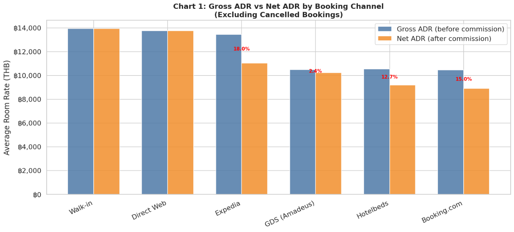

---

### แผนภูมิที่ 2: อัตราการยกเลิก vs ปริมาณ (Dual-axis Bar + Line Chart)
**เหตุผลที่เลือก Dual-axis:** มี **2 Metric ที่มีหน่วยต่างกัน** (% และ count) ต้องการแกน Y สองแกน การวางทับกันช่วยให้เห็นทันทีว่าช่องทางไหนที่ Cancel Rate สูง **และ** มีปริมาณการจองสูงด้วย

**สรุปผล:** Hotelbeds มี Cancel Rate สูงที่สุด 17.4% ขณะที่ Walk-in (310 bookings — สูงสุด) มี Cancel Rate เพียง 12.9% → รองรับ **Hypothesis 2**

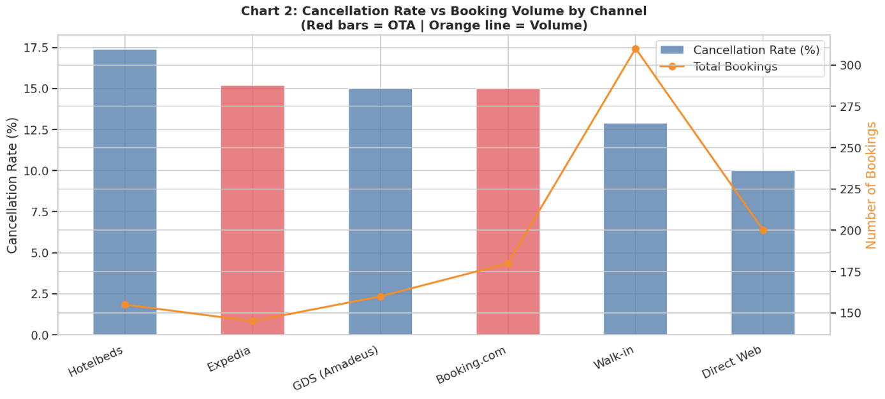

---

### แผนภูมิที่ 3: องค์ประกอบสถานะการจอง (100% Stacked Bar Chart)
**เหตุผลที่เลือก 100% Stacked:** การ normalize เป็น 100% ทำให้ช่องทางที่มีขนาดต่างกันมากเปรียบเทียบ **สัดส่วน** ได้โดยตรง มองเห็นว่าช่องทางไหนมี "ส่วนสีแดง (Cancelled)" ใหญ่แค่ไหน

**สรุปผล:** Hotelbeds และ OTA channels มีสัดส่วน Cancelled สูงกว่า Direct channels โดยเฉพาะเมื่อจับคู่กับ Promotional Rate → รองรับ **Hypothesis 2**

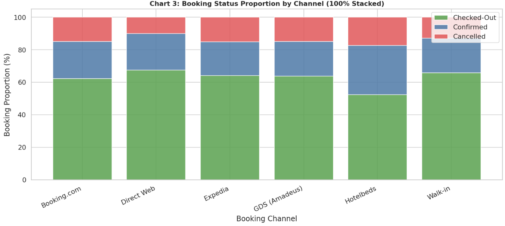

---

### แผนภูมิที่ 4: ค่าใช้จ่ายการตลาดรายเดือน (Stacked Area Chart)
**เหตุผลที่เลือก Stacked Area:** เวลาเป็น **ตัวแปรต่อเนื่องมีลำดับ** → Area/Line chart เหมาะที่สุด การซ้อนกัน (Stacking) แสดงทั้งแนวโน้มรวม และสัดส่วนแต่ละแพลตฟอร์มพร้อมกัน

**สรุปผล:** Google Ads คิดเป็น ~50% ของงบรวม ฿224,309/ปี รวมทุก platform แล้ว True COA = 9.1% ต่ำกว่า OTA avg 16.5% อย่างชัดเจน → รองรับ **Hypothesis 1**

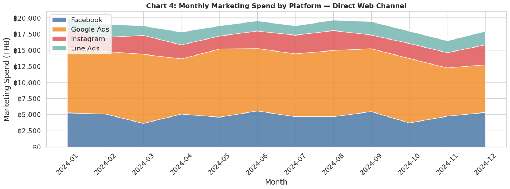

---

### แผนภูมิที่ 5: ตำแหน่งช่องทาง (Bubble Scatter Chart)
**เหตุผลที่เลือก Bubble Chart:** เข้ารหัส **3 ตัวแปรพร้อมกัน** ใน 1 กราฟ: x = Cancel Rate, y = Net ADR, ขนาดฟอง = ปริมาณการจอง Revenue Manager มองเห็นทันทีว่าช่องทางใดอยู่ใน "มุมที่ดีที่สุด" (บนซ้าย = Net ADR สูง, Cancel ต่ำ)

**สรุปผล:** Direct Web และ Walk-in อยู่มุมบนซ้าย (Net ADR สูงสุด, Cancel Rate ต่ำ) Hotelbeds อยู่มุมล่างขวา (Net ADR ปานกลาง, Cancel Rate สูงสุด) → รองรับ **Hypothesis 1**

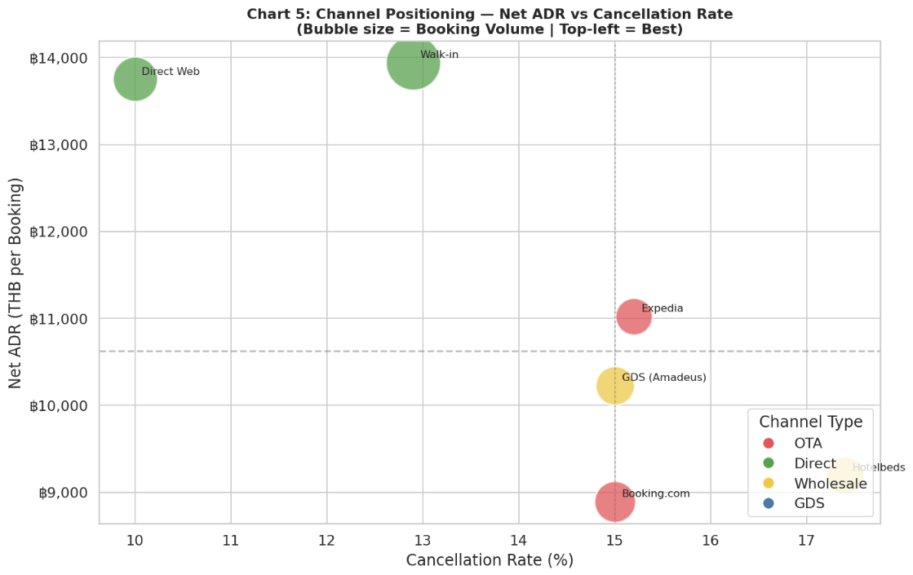

---

###  แผนภูมิที่ 6: Heatmap — Commission Cost % ตาม Channel × Rate Code

**เหตุผลที่เลือก Heatmap:**
Heatmap เหมาะที่สุดเมื่อต้องการแสดง **ความสัมพันธ์ระหว่าง 2 ตัวแปรเชิงหมวดหมู่** (Channel × Rate Code) กับ **1 ตัวแปรเชิงตัวเลข** (Commission %) พร้อมกันในมุมมองเดียว สีเข้ารหัสค่าตัวเลขโดยอัตโนมัติ ทำให้สมองมนุษย์ประมวลผลได้เร็วกว่าการอ่านตาราง (Pre-attentive Visual Processing)

**ทำไมไม่ใช้กราฟประเภทอื่น?**
- **Grouped Bar:** รองรับได้สูงสุด 3–4 กลุ่ม ถ้ามี 6 ช่องทาง × 4 Rate Code จะรกเกินไปอ่านไม่ออก
- **Scatter Plot:** ใช้สำหรับตัวแปรต่อเนื่อง ไม่ใช่ Nominal Category
- **Line Chart:** ไม่เหมาะกับ Nominal Category เพราะไม่มีลำดับที่แท้จริง
- **Pivot Table ตัวเลข:** อ่านได้แต่ไม่เห็นรูปแบบ (pattern) ได้ทันที

**วิธีคำนวณ:**
```
Heatmap Cell Value = Sum(commission_amount) / Sum(gross_room_revenue) × 100
                     [จัดกลุ่มตาม channel_name AND rate_name]
                     [ใช้ active_df — ตัด Cancelled ออก เพราะต้องการต้นทุนที่เกิดขึ้นจริง]
```

**การอ่านค่า:**
- **สีแดงเข้ม (>15%):** คู่ที่แย่ที่สุด ควรลดโควตาทันที
- **สีเหลือง (5–15%):** ต้นทุนปานกลาง ติดตามใกล้ชิด
- **สีเขียว (0–5%):** คู่ที่ดีที่สุด ควรเพิ่มโควตาและงบสนับสนุน

**สรุปผลจาก Heatmap (ข้อมูลจริง):**

| คู่ที่แย่ที่สุด | Commission % | Action |
|----------------|-------------|--------|
| Hotelbeds × Promotional | 20.0% | ลดโควตา RT_PROMO บน Hotelbeds |
| Hotelbeds × Rack Rate | 20.0% | ลดโควตา / ย้ายมา Direct Web |
| Expedia × Corporate | 18.0% | เจรจา Corporate contract ตรง |
| Expedia × Promotional | 18.0% | จำกัดโควตา RT_PROMO บน Expedia |
| Expedia × Rack Rate | 18.0% | ย้าย Rack Rate มา Direct Web |
| Booking.com × ทุก Rate | 15.0% | ติดตาม / จำกัดโควตาบางส่วน |

**ข้อสังเกตสำคัญจาก Heatmap:**
1. **Direct Web และ Walk-in = 0% ทุกคู่** — ยืนยันว่าช่องทางตรงดีที่สุดในทุก Rate Code
2. **Hotelbeds (Merchant model) สูงสุด 20%** — Commission Model แบบ Merchant ไม่ได้ดีกว่า Percentage
3. **GDS (Amadeus) ต่ำที่สุดในกลุ่ม non-Direct** — Flat Fee fixed ฿500 ทำให้ Commission% ต่ำมากสำหรับการจองราคาสูง

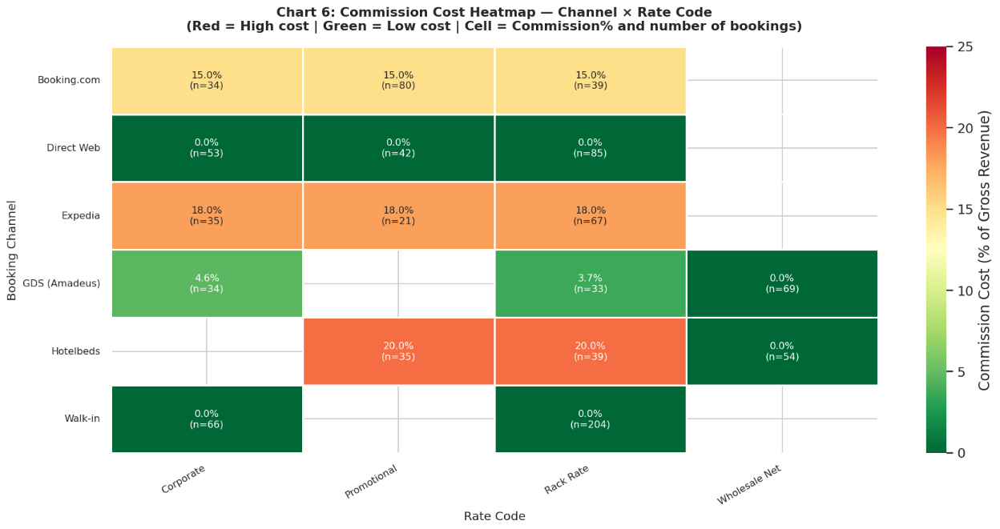

---

## 6. ข้อค้นพบสำคัญ

###  Insight 1 — Direct Channel ได้เปรียบทั้ง Net ADR และ True COA (ตอบ Hypothesis 1)
Direct Channel ครอง **44.3% ของการจองทั้งหมด (510 bookings)** และให้ Net ADR สูงกว่า OTA อย่างมีนัยสำคัญ — Direct Web ฿13,751 vs Booking.com ฿8,893 (ห่างกัน ฿4,858) True COA ของ Direct Web เพียง **9.1%** เทียบกับ OTA avg **16.5%** ยืนยันว่าการลงทุนงบการตลาด ฿224,309/ปีคุ้มค่ากว่าการพึ่งพา OTA

###  Insight 2 — Serial Cancellers ทำลายรายได้สองต่อ (ตอบ Hypothesis 2)
Promotional Rate มี Cancel Rate **24.6%** สูงกว่า Corporate Rate (10.1%) ถึง 2.4 เท่า Hotelbeds มี Cancel Rate สูงสุด 17.4% ในกลุ่ม OTA/Wholesale ความเสียหายซ้ำซ้อน: จ่ายค่าคอมมิชชัน 20% + สูญเสีย Inventory ให้คนที่ไม่มาเข้าพักจริง

###  Insight 3 — คู่ที่อันตรายที่สุดชัดเจนจาก Heatmap (ตอบ Hypothesis 3)
Heatmap เผยให้เห็นว่า Hotelbeds × Promo/Rack (20%) และ Expedia × ทุก Rate Code (18%) คือคู่ที่ดูดกำไรมากที่สุด ข้อมูลนี้ไม่สามารถมองเห็นได้จากการวิเคราะห์แบบ 1 มิติ — ต้องมอง interaction ระหว่าง Channel และ Rate Code พร้อมกันจึงจะเห็น pattern ที่แท้จริง

---

## 7. ข้อเสนอแนะ

###  Recommendation 1: เปลี่ยนนโยบายการยกเลิก → Non-Refundable (แก้ Hypothesis 2)
**Action:** แปลง RT_PROMO (Promotional Rate) เป็น Non-Refundable หรือบังคับมัดจำ 30–50%  
**Impact:** ลด Cancel Rate จาก ~24.6% ลงอย่างมีนัยสำคัญ, เพิ่มความแม่นยำ Revenue Forecasting, ลด Opportunity Cost

###  Recommendation 2: รักษาและขยาย Direct Channel (แก้ Hypothesis 1)
**Action:** รักษางบ Direct Marketing ฿224,309/ปี และเพิ่มประสิทธิภาพ Google Ads Branded + Best Rate Guarantee  
**Impact:** True COA Direct Web (9.1%) ต่ำกว่า OTA avg (16.5%) อยู่แล้ว การเพิ่ม Conversion Rate จะทำให้ COA ลดลงไปอีก

###  Recommendation 3: ขยาย Corporate & B2B Contracts (แก้ Hypothesis 1 & 2)
**Action:** Contract Owners เจรจา Corporate Rate agreements เพิ่มเติม เสนอ Tiered Pricing  
**Impact:** Corporate Bookings Cancel Rate ต่ำสุด 10.1%, Commission 0% (ผ่าน Direct), Stable Cash Flow ช่วง Low Season

###  Recommendation 4 (จาก Heatmap): จำกัดโควตาคู่ที่สีแดง (แก้ Hypothesis 3)
**Action:** ลดโควตาห้องสำหรับ Hotelbeds × Promo/Rack (20%) และ Expedia × ทุก Rate Code (18%) แล้วนำโควตานั้นเปิดขายใน Direct Web แทน  
**Impact:** ทุก 10 ห้องที่ย้ายจาก Hotelbeds × Promo → Direct Web ประหยัด Commission ได้ 20% ของ Gross Revenue นั้น

---
##  EDA และ Visualization

###  Chart 1: Gross ADR vs Net ADR by Channel
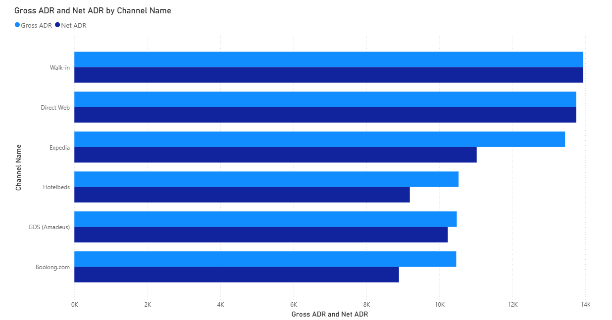

**คำอธิบาย:**  
กราฟเปรียบเทียบรายได้เฉลี่ยต่อ booking ก่อน (Gross ADR) และหลังหักค่าคอมมิชชัน (Net ADR) ของแต่ละช่องทาง

**Insight:**  
- Direct Web และ Walk-in ไม่มีค่าคอมมิชชัน → Net ADR เท่ากับ Gross ADR  
- OTA เช่น Booking.com และ Expedia มี Net ADR ลดลงจาก commission 15–18%  
- แสดงให้เห็นการสูญเสียรายได้จาก OTA อย่างชัดเจน  


---

###  Chart 2: Cancel Rate vs Total Bookings
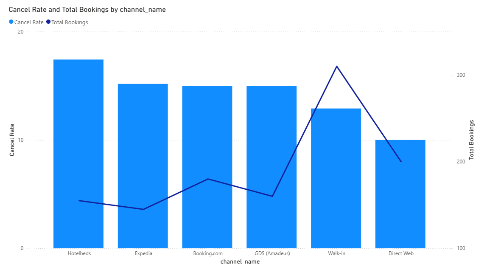

**คำอธิบาย:**  
กราฟแสดงอัตราการยกเลิก (Cancel Rate) เทียบกับจำนวน booking ของแต่ละช่องทาง

**Insight:**  
- Hotelbeds มี Cancel Rate สูงที่สุด (~17%)  
- Walk-in มี booking สูงแต่ Cancel ต่ำ → คุณภาพดี  
- OTA มีทั้ง volume และ cancel สูง → เสี่ยงต่อรายได้  


---

###  Chart 3: Booking Status Proportion
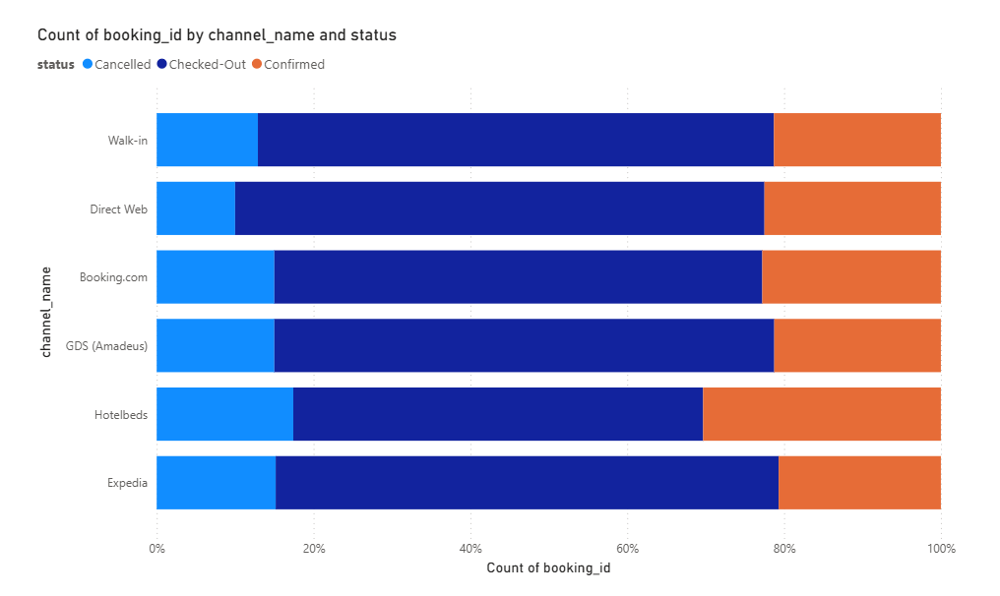

**คำอธิบาย:**  
กราฟ 100% stacked แสดงสัดส่วนสถานะการจอง (Cancelled / Checked-out / Confirmed)

**Insight:**  
- OTA และ Wholesale มีสัดส่วน Cancel สูงกว่า Direct  
- Direct channel มี booking ที่กลายเป็นรายได้จริงมากกว่า  
- สะท้อนปัญหา Serial Cancellers  


---

###  Chart 4: Monthly Marketing Spend
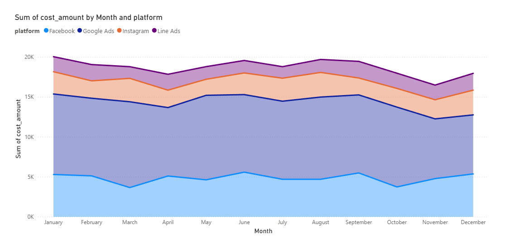

**คำอธิบาย:**  
กราฟแสดงค่าใช้จ่ายการตลาดรายเดือน แยกตาม platform

**Insight:**  
- Google Ads ใช้งบสูงสุด (~50%)  
- งบรวม ~224,309 บาท/ปี  
- True COA ~9.1% ต่ำกว่า OTA commission (~16.5%)  


---

###  Chart 5: Channel Positioning (Bubble Chart)
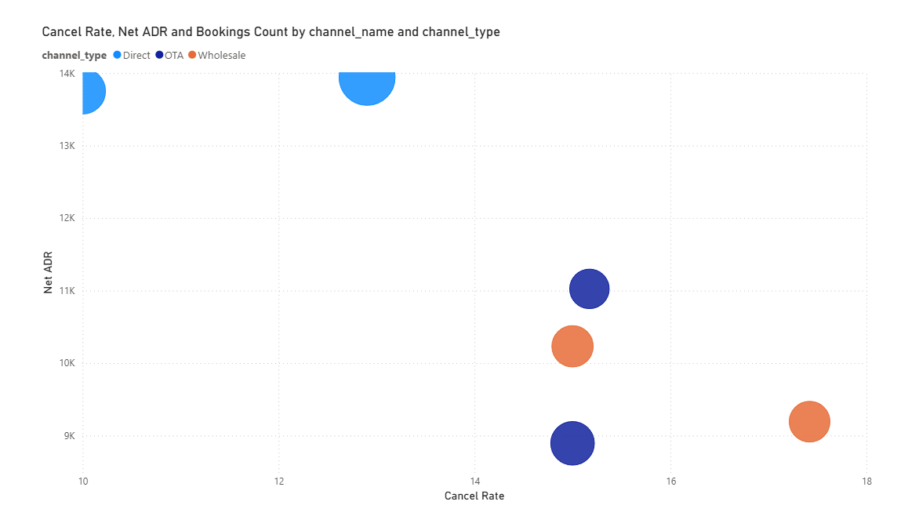

**คำอธิบาย:**  
Bubble chart แสดง  
- X-axis = Cancel Rate  
- Y-axis = Net ADR  
- ขนาด bubble = จำนวน booking  

**Insight:**  
- Direct (Walk-in, Direct Web) อยู่มุมบนซ้าย → ดีที่สุด  
- Hotelbeds อยู่มุมล่างขวา → แย่สุด (Cancel สูง + Net ADR ต่ำ)  
- ใช้ช่วยตัดสินใจเลือก Channel ที่ควรเพิ่มหรือลด  


---

###  Chart 6: Commission Heatmap
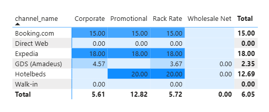

**คำอธิบาย:**  
Heatmap แสดง % commission ตาม Channel × Rate Code

**Insight:**  
- Hotelbeds × Promo/Rack = สูงสุด (~20%)  
- Expedia ทุก rate ≈ 18%  
- Direct = 0% → ดีที่สุด  
- ใช้หา “จุดที่กำไรหายหนักที่สุด”  


---

###  Data Model (Schema)
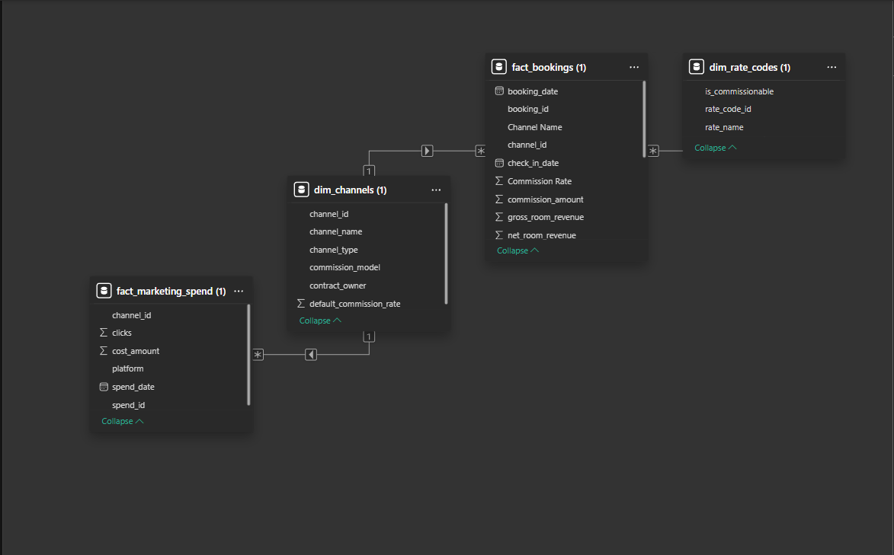

**คำอธิบาย:**  
โครงสร้างข้อมูลแบบ Star Schema เชื่อม fact และ dimension tables

**Insight:**  
- รองรับการวิเคราะห์หลายมิติ (Channel, Rate Code, Time)  
- ใช้คำนวณ Net Revenue, Cancel Rate และ Commission ได้ถูกต้อง  


---

##  Recommendations (Power BI)

### 1. ลด Cancel Rate
- เปลี่ยน Promotional Rate เป็น Non-refundable หรือเก็บมัดจำ  
- ลดปัญหา Serial Cancellers  

### 2. เพิ่ม Direct Booking
- ลงทุน Google Ads และ Brand Campaign  
- ใช้ Best Rate Guarantee  

### 3. ลดการพึ่ง OTA
- จำกัด quota ห้องใน OTA  
- Shift booking มาที่ Direct Channel  

### 4. Optimize Channel Mix
- ลด Hotelbeds และ Expedia (commission สูง)  
- เพิ่ม Direct และ Corporate booking  


> วิเคราะห์และสร้าง Dashboard ด้วย Power BI


## 8. โครงสร้างโปรเจกต์

```
azure-stay-channel-profitability/
│
├── data/
│   ├── fact_bookings.csv           # 1,150 รายการจอง
│   ├── dim_channels.csv            # 6 ช่องทางพร้อมคำนิยามต้นทุน
│   ├── dim_rate_codes.csv          # 4 ประเภทอัตรา
│   └── fact_marketing_spend.csv    # 48 แถวค่าใช้จ่ายการตลาด (4 platforms × 12 เดือน)
│
├── notebooks/
│   └── azure_stay_channel_profitability_analysis.ipynb  # Notebook หลัก
│
├── images/
│   ├── chart1_gross_vs_net_adr.png       # H1: Grouped Bar
│   ├── chart4_cancellation_rate.png      # H2: Dual-axis
│   ├── chart5_status_stacked.png         # H2: 100% Stacked Bar
│   ├── chart6_marketing_spend.png        # H1: Stacked Area (True COA)
│   ├── chart7_channel_scatter.png        # H1: Bubble Scatter
│   └── chart8_heatmap_commission.png     # H3: Heatmap
│
└── README.md
```

---

## 9. วิธีรันโปรแกรม

### ตัวเลือก A — Google Colab (แนะนำ)
1. อัปโหลดโฟลเดอร์ `data/` ขึ้น Google Drive
2. เปิด `notebooks/azure_stay_channel_profitability_analysis.ipynb` ใน Colab
3. ยกเลิก comment ส่วน Google Drive mount (Option B ในเซลล์ที่ 1)
4. รันทุกเซลล์ตามลำดับ

### ตัวเลือก B — Python ในเครื่อง
```bash
git clone https://github.com/<username>/azure-stay-channel-profitability.git
cd azure-stay-channel-profitability
pip install pandas numpy matplotlib seaborn
jupyter notebook notebooks/azure_stay_channel_profitability_analysis.ipynb
```

### Dependencies
| Library | Version | วัตถุประสงค์ |
|---------|---------|-------------|
| pandas | ≥ 1.5 | Data manipulation & joins |
| numpy | ≥ 1.23 | Numerical operations |
| matplotlib | ≥ 3.6 | Static charts |
| seaborn | ≥ 0.12 | Statistical visualizations incl. Heatmap |

---


